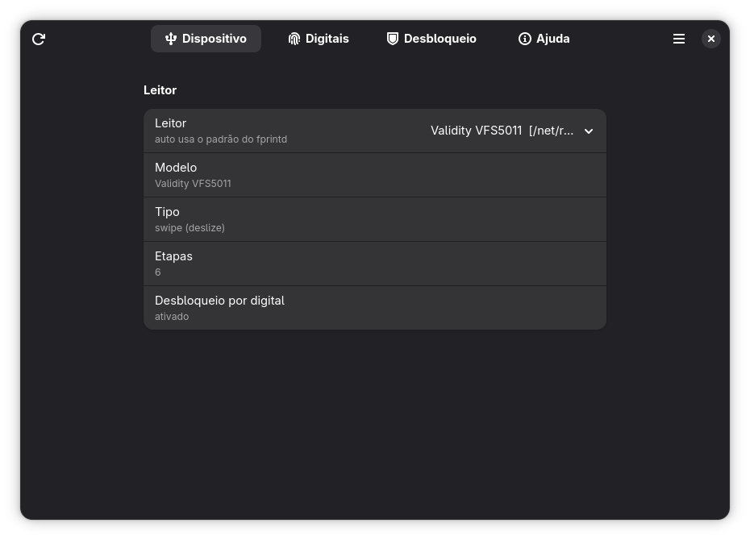
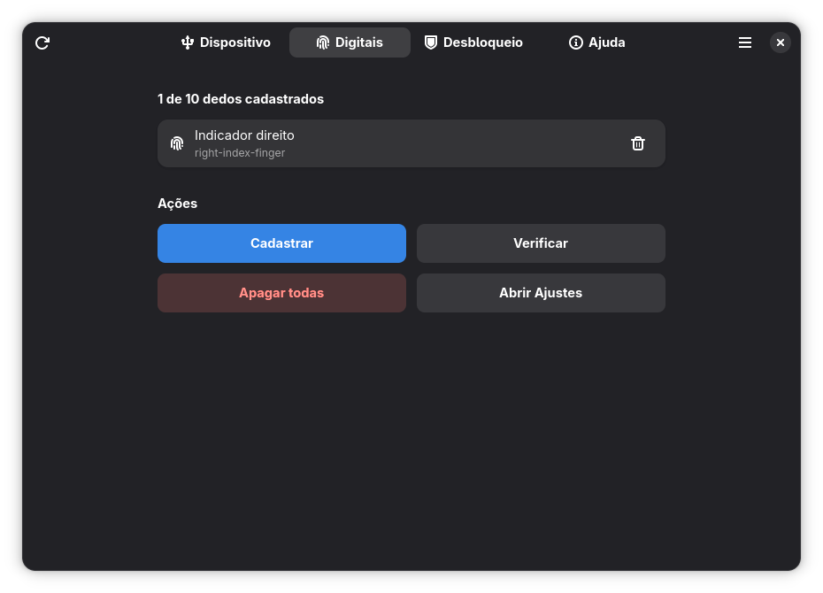
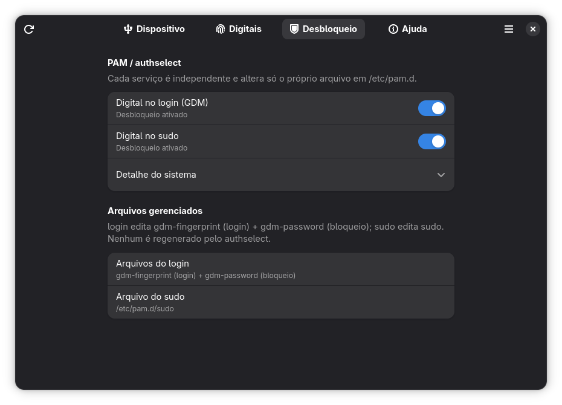
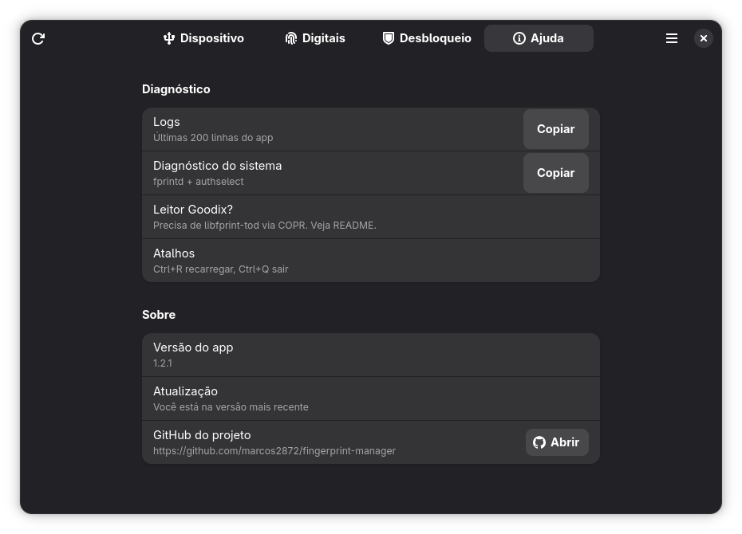
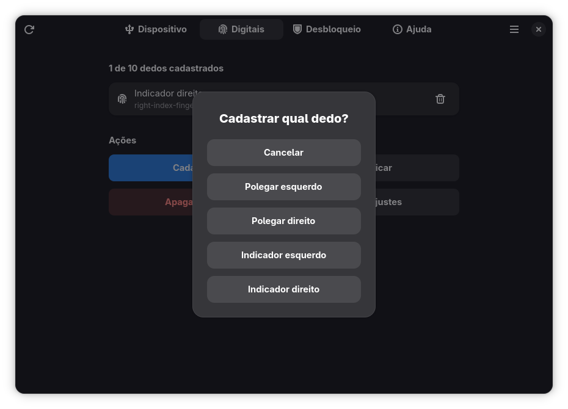
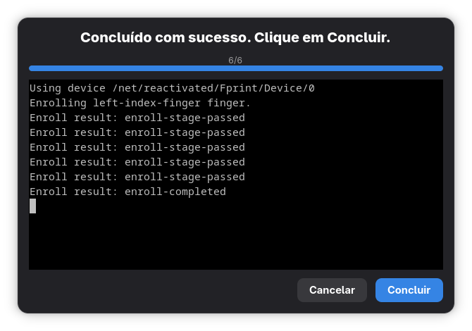

# Fingerprint Manager

App GTK4/Adwaita para gerenciar **cadastro de digitais e desbloqueio por biometria**
no Fedora/GNOME.

- Janela com 4 páginas: **Dispositivo · Digitais · Desbloqueio · Ajuda**
- Cadastro/verificação via `fprintd-enroll` / `fprintd-verify` em terminal **Vte embutido**
- Digital para **login (GDM) e sudo de forma independente**, via helper
  privilegiado (`pkexec`) com backup e validação
- Genérico: qualquer leitor do `net.reactivated.Fprint` (Validity, Goodix, Synaptics, ELAN…)

## Capturas de tela








## Requisitos (Fedora)

```bash
sudo dnf install python3 python3-gobject gtk4 libadwaita vte291-gtk4 \
  fprintd authselect polkit gnome-control-center
python3 -m pip install --user pytest   # só para rodar os testes
```

## Instalar no Fedora (via COPR)

```bash
sudo dnf copr enable marcos2872/fingerprint-manager
sudo dnf install fingerprint-manager
fingerprint-manager
```

> O COPR é um repo de terceiros (não é o repo oficial do Fedora):
> precisa do `copr enable` uma vez. A entrada nos repos oficiais
> (instalação direta sem enable) depende do Package Review.

## Modo dev (rodar sem instalar)

```bash
uv sync                               # uma vez (cria .venv com gi do sistema)
uv run ./run.sh                       # roda o app
# sem uv: ./run.sh usa o python3 do sistema
```

O `run.sh` compila o schema local (`data/`), instala ícone + atalho dev em
`~/.local/share` e prefere `.venv/bin/python` quando existe.

Atalhos: `Ctrl+R` recarrega · `Ctrl+Q` sai · `Esc` cancela enroll.

Diagnóstico:

```bash
fprintd-list $USER
journalctl --user -f
```

## Testes

```bash
uv run pytest tests/                  # backend (headless, D-Bus e rede mockados)
RUN_GUI_TESTS=1 uv run pytest tests/  # inclui UI (precisa de display)
```

Setup uma vez: `uv venv --system-site-packages && uv sync` (o `gi`/GTK vem
do sistema; sem isso o `import gi` falha na venv isolada). `.venv/` é
gitignored. Sem uv: `pytest` / `python3 -m pip install --user pytest ruff`.

Fixtures PAM usam `FPRINT_PAM_DIR` (nunca encostam em `/etc/pam.d`).

Lint: `uv run ruff check .`.

## Gerar e instalar o RPM (Fedora)

```bash
sudo dnf install rpmdevtools rpm-build
rpmdev-setuptree
VERSION=0.1.0
tar --exclude=.git -czf ~/rpmbuild/SOURCES/fingerprint-manager-$VERSION.tar.gz \
  --transform "s,^,fingerprint-manager-$VERSION/," \
  main.py backend ui data assets run.sh README.md AGENTS.md LICENSE RELEASE.md packaging/fingerprint-manager.spec
rpmbuild -ba packaging/fingerprint-manager.spec
# o rpm sai em ~/rpmbuild/RPMS/noarch/
sudo dnf install ~/rpmbuild/RPMS/noarch/fingerprint-manager-*.rpm
```

O que o pacote instala:

| Arquivo | Destino |
|---|---|
| `fingerprint-manager` (launcher) | `/usr/bin/` |
| app (`main.py`, `backend/`, `ui/`) | `/usr/share/fingerprint-manager/` |
| schema GSettings | `/usr/share/glib-2.0/schemas/` |
| atalho | `/usr/share/applications/io.github.marcos2872.fingerprint-manager.desktop` |
| metainfo (loja) | `/usr/share/metainfo/io.github.marcos2872.fingerprint-manager.metainfo.xml` |

Autostart manual (abre a janela ao iniciar a sessão):

```bash
cp /usr/share/applications/io.github.marcos2872.fingerprint-manager.desktop \
   ~/.config/autostart/io.github.marcos2872.fingerprint-manager.desktop
```

## Desinstalar

```bash
sudo dnf remove fingerprint-manager
rm -f ~/.config/autostart/io.github.marcos2872.fingerprint-manager.desktop
# restos do modo dev (run.sh instala atalho + ícone locais):
rm -f ~/.local/share/applications/io.github.marcos2872.fingerprint-manager.desktop
rm -f ~/.local/share/icons/hicolor/scalable/apps/fingerprint-manager.svg
```

PAM: o `dnf remove` **não** desfaz as linhas de digital em `/etc/pam.d`.
Antes de desinstalar, desligue os dois switches na aba Desbloqueio —
ou restaure os backups manualmente (troque a data pela que o `ls` mostrar;
`<...>` não pode ir literal no comando, o shell interpreta como redireção):

```bash
ls /etc/pam.d/*.bak-fingerprint-manager-*
sudo cp /etc/pam.d/sudo.bak-fingerprint-manager-20260919-191157 /etc/pam.d/sudo
sudo cp /etc/pam.d/gdm-fingerprint.bak-fingerprint-manager-20260919-191128 /etc/pam.d/gdm-fingerprint
grep -r pam_fprintd /etc/pam.d/ || echo "limpo"
```

## Layout do repo

```
fingerprint-manager/
  main.py                 # Adw.Application single-instance
  backend/fprintd.py      # GetDevices, props, ListEnrolledFingers (Gio.DBusProxy)
  backend/pam.py          # leitura por serviço + escrita via helper/pkexec
  backend/pam_helper.py   # edita /etc/pam.d como root (backup + validação)
  ui/window.py            # ApplicationWindow + ViewStack com PreferencesPages
  ui/enroll_view.py       # Vte embutido para enroll/verify
  data/*.gschema.xml      # refresh, device-path
  data/*.desktop
  assets/icon.svg         # ícone do app (hicolor scalable)
  assets/github-mark-symbolic.svg  # Octocat da aba Ajuda (via search-path)
  packaging/*.spec        # RPM Fedora
  run.sh                  # modo dev
```

## Notas honestas

- **Goodix:** precisa de `libfprint-tod` via COPR (ver Ajuda no app).
- `NoEnrolledPrints` = zero digitais, não é erro.
- Login edita `/etc/pam.d/gdm-fingerprint` (tela de login) e
  `/etc/pam.d/gdm-password` (tela de bloqueio); sudo edita `/etc/pam.d/sudo`
  (linha `sufficient`: falha cai para senha, nunca trava o login).
  Backups em `/etc/pam.d/*.bak-fingerprint-manager-*`.
